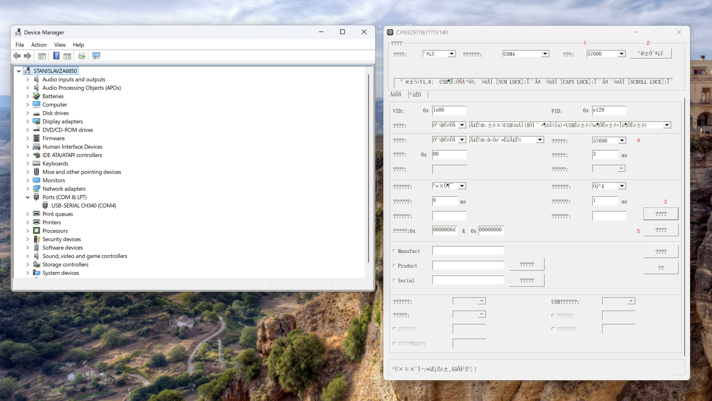

# KVM Serial for macOS and Elgato 4K S

> This repository is a fork of [sjmf/kvm-serial](https://github.com/sjmf/kvm-serial), originally created by [Samantha Finnigan (@sjmf)](https://github.com/sjmf).

## Purpose

KVM Serial displays another computer through an HDMI capture device and forwards the Mac's keyboard and mouse through a CH9329 USB HID emulator. This fork provides low-latency control optimized for macOS and the Elgato 4K S, without requiring remote-control software on the managed computer.

## Required hardware

- **CH340 to CH9329 USB HID control cable** — available from [AliExpress](https://www.aliexpress.us/item/3256812223796600.html) or [eBay](https://www.ebay.com/itm/168631109700).
- **Elgato 4K S capture card** — available from [Amazon](https://www.amazon.com/Elgato-Capture-Card-Xbox-Switch/dp/B0FFTFYGLV/r).

## Changes in this fork

- Native macOS AVFoundation capture for the Elgato 4K S, including 4K at 60 FPS and a GPU-backed preview.
- Lower-latency mouse forwarding, event coalescing, and serial pacing.
- Correct mouse button-state handling to prevent accidental dragging and text selection.
- Double-click support and reliable modifier-key shortcuts.
- Optional mapping of macOS Command shortcuts to Windows Control shortcuts, replacing the need for AutoHotkey for common combinations such as Command+C and Command+V.
- Physical-key handling for non-Latin macOS layouts, including Russian.
- Native macOS pointer hiding with improved fullscreen behavior. The pointer is hidden by default.
- The status bar is hidden by default.
- HDMI audio monitoring from the capture device on macOS.
- Optional input-latency diagnostics.
- Clean shutdown handling for the packaged macOS application.
- Reliable configuration storage when running from a packaged `.app` bundle.

## Run locally

Python 3.10 or newer is required.

```bash
python3 -m venv .venv
source .venv/bin/activate
python -m pip install -e ".[dev]"
python -m kvm_serial
```

## Build for macOS

```bash
source .venv/bin/activate
python -m pip install -e ".[dev]"
pyinstaller --clean --noconfirm kvm-gui.spec
codesign \
  --force \
  --deep \
  --sign - \
  --entitlements assets/entitlements.plist \
  "dist/KVM Serial.app"
codesign --verify --deep --strict --verbose=2 "dist/KVM Serial.app"
```

The finished application is created at `dist/KVM Serial.app`.

## Change the CH9329 baud rate

The default `9600` baud rate works, but serial transmission adds noticeable keyboard and mouse latency. Increasing it to `57600` reduces the transmission time by roughly 11–12 ms per input report.

The CH9329 baud rate was changed on Windows using:

- [CH9329 dual-ended cable instructions](https://blog.csdn.net/qishi3250/article/details/130596635?spm=1001.2014.3001.5501)
- [CH9329 configuration utility](https://github.com/lessthan00/wch-reference-designs/raw/refs/heads/main/CH9329EVT.ZIP)
- [WCH CH341 Windows driver](https://www.wch.cn/downloads/CH341SER_EXE.html)

Connect both ends of the CH9329 cable, install the CH341 driver, extract `CH9329EVT.ZIP`, and open `CH9329Test_CfgTool.exe`.



Using the numbered controls in the screenshot:

1. Select the standard `9600` baud rate used by the cable before reconfiguration.
2. Click **Search Device**. The configuration fields should populate.
3. Click **Read Configuration**.
4. Change the device baud rate to `57600`.
5. Click **Save Configuration**.
6. Disconnect both ends of the cable for five seconds.
7. Reconnect the cable and use `CH9329Test_CfgTool.exe` at `57600` baud to verify that the new setting was applied.

> **Important:** Keep both the CH9329 work mode and serial communication mode set to `0` (protocol transmission mode). Do not select ASCII or transparent transmission mode; KVM Serial uses the CH9329 binary protocol.

Finally, open KVM Serial and select **Options → Baud Rate → 57600**, then select **File → Save Configuration**.

## License

Copyright © 2023–2026 Samantha Finnigan and contributors. Released under the [MIT License](LICENSE.md).
